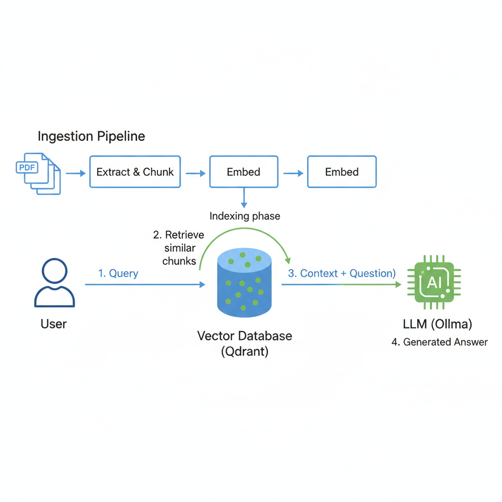

# My Little French Layer (MLFL)

A RAG (Retrieval Augmented Generation) pipeline for querying French legal documents.



## Pipeline Steps

### 1. Download Legal PDFs

Download law codes from Legifrance:
- https://www.legifrance.gouv.fr/liste/code?etatTexte=VIGUEUR&etatTexte=VIGUEUR_DIFF

Place PDF files in `01_extract_content/input/`.

### 2. Extract & Chunk

Extract text from PDFs and split into chunks for indexing.

```bash
python 01_extract_content/extract.py
```

### 3. Inject into Vector Database

Load chunks and inject into Qdrant using [BGE embeddings](https://huggingface.co/BAAI/bge-small-en-v1.5).

```bash
python 02_inject_rag/inject.py
```

### 4. Query with RAG

Chat with the legal assistant using context from the vector database.

```bash
python 03_query/query.py
```

Compare `query.py` (with RAG) and `query_vanilla.py` (without RAG) to see the difference.

## Requirements

- Qdrant running on `localhost:6333`
- Ollama with a model installed (e.g., `smollm2:1.7b`)
